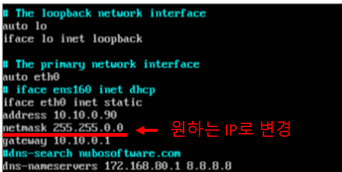

# NUBO 앱 관리 페이지
> 해당 프로젝트는 (주)다우데이타에서 인턴기간동안(2021.01~2021.08, 8개월) 진행하였으며, 'NUBO'앱 관리자용 웹페이지입니다.

[![NPM Version][npm-image]][npm-url]
<br><br><br><br>
**실행 화면 예시**
<br>


<br/><br/><br/><br/><br/>

## 목차
  
- [ 1. 프로젝트 개요 ](#1)
  
- [ 2. 프로젝트 세부사항 ](#2)
  
- [ 3. 프로젝트 기능 ](#3)
  
- [ 4. Flow Chart ](#4)
  
- [ 5. 개발 환경 설정(마이그레이션)](#5)
 
  
  
  
  <br/><br/><br/><br/><br/><br/><br/><br/>
  
  
  
  
  
<a name="1"></a>
## 1. 프로젝트 개요

**제작배경**
- Nubo 웹페이지 보완 필요, 파일 관리 페이지 부재
<br/>
**제작목적**
- Nubo 기본 웹페이지 생성 및 사 웹페이지 관리
- 파일 관리 용이성 증대
<br/>
**기대효과**
- Nubo 제품에 대한 기본 웹사이트 보유 및 관리 간편화
<br/>
**기능요약**
- 고객사 웹페이지 통합관리 및 앱 파일 관리
<br/>
**요구사항**
- Android용 apk 및 iOS용 ipa 파일 다운로드 페이지 구현
- 앱파일 CRUD기능 구현
- 다양한 버전 관리(Prod, Wifi 등)
- 버전 앱 파일 관리
- 고객사 별 사이트 관리
- 지속적인 사용을 위해 자동화 기능 구현 필요
- 데스크탑/ 모바일 UI 지원(=미디어쿼리)


<br/><br/><br/><br/><br/><br/><br/><br/>


<a name="2"></a>
## 2. 프로젝트 세부사항
<br/>
**< skills >**
<br/><br>
**프론트엔드** : Html, CSS, JavaScript

**백엔드** : Node.js(+ express, ejs)

**데이터베이스** : MariaDB

**서버** : Citrix XenServer, Linux OS

**버전관리** : Github, Jira Software
<br/><br/><br/><br/>


**< 전체 구조 >**


**< DB 구조 >**


**< 디렉토리 구조 >**


<br/><br/><br/><br/><br/><br/><br/><br/>


<a name="3"></a>
## 3. 프로젝트 기능

**1) Create - App 및 기업 정보**


-> 필수입력값만 입력 후 파일을 업로드하면 나머지 정보들(OS, type등)은 파일명을 통해 자동쿼리되도록 만들었습니다.

<br/><br/>
**2) Read - App 및 기업 정보**


-> 업로드된 파일 목록이 정보와 함께 테이블로 출력됩니다.<br>

-> 단일파일의 다운로드, 수정, 삭제, 세부정보 기능을 지원합니다.

-> 테이블 좌측 상단의 아이콘들을 통해 파일 업로드 및 휴지통 이동이 가능합니다.
<br/><br/>

**3) Upload - App 및 기업 정보**


-> 업로드 된 파일 중, 수정하고 싶은 파일의 정보를 갱신합니다.

-> 파일의 정보 중, 수정가능한 정보값만 갱신할 수 있습니다.
<br/><br/>

**4) Delete - App 및 기업 정보**

1 - 휴지통으로 삭제할 App이나 기업 정보 이동


<br>
2 - 휴지통에 있는 App이나 기업 정보 복구 및 완전 삭제


--> 파일은 한번 삭제시 휴지통으로 이동하며, 복구 또는 완전삭제 기능을 지원합니다.
<br/><br/>

**5) 고객사 웹페이지 출력**


-> 기업 정보를 등록한 파트너사들의 앱 다운로드 페이지들이 링크되어 출력됩니다.

-> 기업 아이콘 클릭시, 해당 기업의 앱 다운로드 페이지로 이동합니다.

<br/><br/>
**6) 고객사 앱 다운로드 페이지**


-> 해당 기업의 앱 시작 화면이 출력되고, 업로드 한 앱들을 OS별, Type별로 선택한 후 다운로드 할 수 있습니다.

-> 이 페이지가 실제 고객사에 전달되는 다운로드 페이지 입니다.

<br/><br/>
**7) Media Quiry**


-> 데스크톱, 테블릿, 모바일에서의 화면 크기 조정 기능을 지원합니다.


<br/><br/>


<br/><br/><br/><br/><br/><br/>


<a name="4"></a>
## 4. Flow Chart

**< 초기 구축시 관리자 관점 >**


**< 추후 업데이트시 관리자 관점 >**


**< 사용자 관점 >**


<br/><br/>


<br/><br/><br/><br/><br/><br/>


<a name="5"></a>
## 5. 개발 환경 설정(마이그레이션)

[Server - XenServer에서 Linux OS 사용]

1. IP 설정
```sh
$sudo vi /etc/network/interfaces
``` 

<br/>

2. mysql에 접속 후 초기세팅 sql파일 import 및 사용자 권한 부여
```sh
$mysql –uroot –ppassword
> source 파일명.sql     
$ mysql –uroot –ppassword
> use  데이터베이스명
> create user 'web’@’해당 서버 IP' identified by '123456';
> grant all privileges on 데이터베이스명.* to 'web'@'%';
``` 
<br/>
3. 해당 소스파일 업로드 
: winSCP를 이용하여 웹서버에 전송
<br/>
4. 사용할 모듈 설치
```sh
$ sudo npm install express
$ sudo npm install mysql
$ sudo npm install multer
$ sudo npm install dialog  
``` 
<br/>
5. 웹 서비스 파일 생성 
```sh
$ vi nuboWeb.service
```
<br/><br/>

---end---


<br/>
<!-- Markdown link & img dfn's -->
[npm-image]: https://img.shields.io/npm/v/datadog-metrics.svg?style=flat-square
[npm-url]: https://npmjs.org/package/datadog-metrics
[npm-downloads]: https://img.shields.io/npm/dm/datadog-metrics.svg?style=flat-square
[travis-image]: https://img.shields.io/travis/dbader/node-datadog-metrics/master.svg?style=flat-square
[travis-url]: https://travis-ci.org/dbader/node-datadog-metrics
[wiki]: https://github.com/yourname/yourproject/wiki
